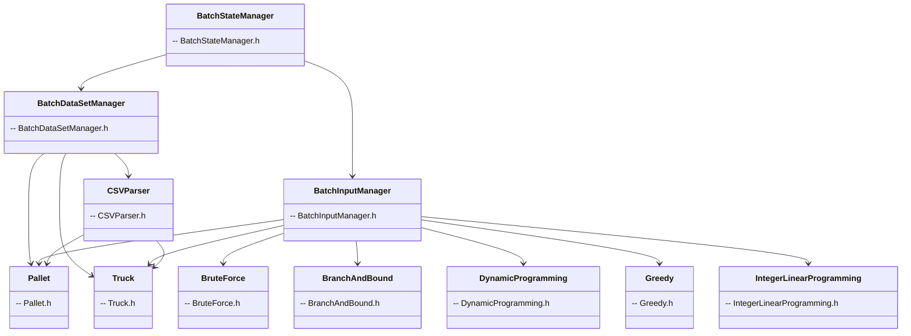

# Packing Optimization: Algorithmic Strategies & Analysis

---

## Introduction

Packing optimization is a classic problem in combinatorial optimization, with applications ranging from logistics and resource allocation to finance and computer science. This project explores and compares a variety of algorithmic strategies for solving the 0/1 knapsack problem, focusing on both exact and approximate methods. The goal is to analyze the strengths, weaknesses, and practical performance of each approach, while also highlighting the engineering and design decisions made throughout the development process. The following presentation provides a comprehensive overview of the project, including system architecture, dataset handling, algorithmic analysis, user interface, and key insights gained during implementation and testing.

---

## Identification of Work and Group Members

- **Project:** Packing Optimization Algorithms
- **Course:** DA 2024/25
- **Group Members:**
  - Arnaldo Lopes | up202307659
  - João Silva | up202303829
  - Pedro Coelho | up202306714

---

## Class Diagram & File Involvement



- This diagram shows how the batch system manages dataset loading, parsing, and algorithm execution, and which files are involved in each class in a simplified way.

---

## Reading the Dataset

- **CSVParser** loads pallets and truck data from CSV files.
- **BatchDataSetManager** uses `CSVParser` to populate `std::vector<Pallet>` and `Truck`.
- Datasets are selected and loaded interactively or via batch mode.

---

## Implemented Functionalities & Algorithms

- **Brute Force (BF):** Exhaustively checks all possible combinations to guarantee the optimal solution. Impractical for large datasets due to exponential time.
- **Backtracking (BT):** Prunes branches exceeding constraints, exploring only feasible combinations. Faster than brute force, but still exponential in worst case.
- **Branch & Bound (BB):** Uses upper bounds to prune the search space. In practice, BB is the fastest and most robust approach for almost all real-world datasets, consistently outperforming other methods by solving most instances in microseconds. Only specially crafted pathological cases can slow it down significantly.
- **Dynamic Programming (DP):**
  - **DP Vector (Bottom-Up):** Fills a table for all capacities, reconstructs solution, ideal for dense problems.
  - **DP HashMap (Top-Down):** Memoized recursion, efficient for sparse problems, saves memory when few states are used.
  - **DP Optimized (2 Rows):** Uses only two rows for memory efficiency, computes only max profit (no reconstruction).
- **Greedy Approximation:** Selects items by profit-to-weight ratio. Fastest, but not always optimal.
- **Integer Linear Programming (ILP):**
  - **Python (PuLP):** Flexible, slower, customizable.
  - **C++ (OR-Tools):** Fastest, robust, can be tuned for secondary objectives.

---

## Strategy Analysis

- **Brute Force:** Always optimal, but only feasible for very small datasets.
- **Backtracking:** Prunes infeasible branches, much faster than BF for moderate datasets, but still exponential.
- **Branch & Bound:** Prunes aggressively using bounds, solves most datasets quickly, but can be trapped by specially crafted instances.
- **DP Vector:** Fast and reconstructs solutions for small/medium dense problems, but memory usage grows with capacity.
- **DP HashMap:** Best for sparse problems, saves memory, sometimes faster than vector.
- **DP Optimized:** Minimal memory, only max profit, not suitable for reconstructing solutions.
- **Greedy:** Extremely fast, but can miss optimal solutions, especially when high-value items have lower ratios.
- **ILP:** Always optimal, robust for all dataset sizes, C++ version is fastest, Python is more flexible.

---

## Data Structures Used

- **Brute Force / Backtracking / Branch & Bound:** Arrays or vectors
- **DP Vector:** 2D array/vector (table)
- **DP HashMap:** Hash map (dictionary)
- **DP Optimized:** Two arrays/vectors
- **Greedy:** Array/vector
- **ILP:** Arrays, variables, constraints (solver-specific)

---

## Time & Space Complexities

| Strategy         | Time Complexity       | Space Complexity  |
| ---------------- | --------------------- | ----------------- |
| Brute Force      | O(2^n)                | O(n)              |
| Backtracking     | O(2^n) (pruned)       | O(n)              |
| Branch & Bound   | O(2^n) (pruned, fast) | O(n)              |
| DP Vector        | O(nW)                 | O(nW)             |
| DP HashMap       | O(#states)            | O(#states)        |
| DP Optimized     | O(nW)                 | O(W)              |
| Greedy           | O(n log n)            | O(n)              |
| ILP (Python/C++) | Depends on solver     | Depends on solver |

- n = number of items, W = capacity, #states = number of unique (item, capacity) pairs used.

---

## Comparative Analysis


*Figure: Timing comparison of all algorithms on all datasets. The y-axis is logarithmic, so each step represents a multiplication (e.g., 10, 100, 1000, ...). This allows both fast and slow algorithms to be compared on the same plot.*

- **BF/BT:** Only for very small datasets. Exponential time.
- **BB:** Dominates in practice, solving almost all datasets in microseconds. Only fails to be fast on rare, specially crafted pathological cases (e.g., many similar ratios or ambiguous choices).
- **DP Vector:** Best for small/medium, dense problems. Memory grows with capacity.
- **DP HashMap:** Best for sparse, large-capacity problems. Saves memory, sometimes faster.
- **DP Optimized:** Minimal memory, but cannot reconstruct solution.
- **Greedy:** Fastest, and in practice often very close to optimal. Despite not having a constant-factor approximation guarantee, it frequently gives highly accurate results. However, it can also perform poorly—not only on classic traps (e.g., large high-value items with low ratio), but also on certain crafted or edge-case datasets where its heuristic fails to capture the optimal structure.
- **ILP:** Always optimal, robust for all sizes. C++ is fastest, Python is flexible.

---

## Summary Table: Strengths & Weaknesses

| Strategy       | Strengths                   | Weaknesses                            |
| -------------- | --------------------------- | ------------------------------------- |
| Brute Force    | Always optimal              | Exponential time, impractical         |
| Backtracking   | Prunes, faster than BF      | Still exponential, times out          |
| Branch & Bound | Fast, prunes aggressively   | Can be trapped, not always meaningful |
| DP Vector      | Fast, reconstructs solution | High memory for large W               |
| DP HashMap     | Memory efficient for sparse | Slower for dense, hash overhead       |
| DP Optimized   | Minimal memory              | No solution reconstruction            |
| Greedy         | Fastest, simple             | Not always optimal                    |
| ILP            | Always optimal, robust      | Complex setup, can be overkill for small/medium problems |

---

## User Interface & Example of Use

- The application provides a clear command-line interface for interactive and batch use.
- **Dataset selection:**

  - Files should be named `Pallets_<X>.csv` and `TruckAndPallets_<X>.csv`.
  - Example prompt:

    ```
    Files should be in the format:
    Pallets_<X>.csv
    TruckAndPallets_<X>.csv

    <X> (empty line to exit):  01
    ```

- **Main menu:**

  - After dataset selection, the user sees:

    ```
    ----- PACKING OPTIMIZATION -----

    1: Run Algorithms
    2: Select Dataset
    3: Show Dataset
    4: Change Timeout

    Choose an option (empty line to exit): 1
    ```

- **Algorithm selection:**

  - User chooses from all implemented algorithms:

    ```
    1: BF
    2: BT
    3: BB
    4: DP-VECTOR
    5: DP-HASHMAP
    6: DP-OPTIMIZED
    7: GREEDY-APPROX
    8: ILP-CPP
    9: ILP-PY

    Choose algorithm (empty line to exit): 1
    ```

- **Output:**

  - After running, a result file (e.g., `output/bf.txt`) is generated with the solution details, such as:

    ```
    id, profit, weight
    3, 10, 50
    5, 9, 33
    7, 7, 11
    9, 3, 3

    Total Weight: 97
    Maximum Profit: 29

    [BF] Execution time: 648 μs
    ```

- **Navigation:**
  - The user can travel through the batch menu, go back, change dataset, show dataset, set timeout limit, and more, making the interface flexible for experimentation and analysis.

---

## Highlight: Custom Branch & Bound Pruning & Main Difficulties

### Functionality to Highlight

- **Custom Branch & Bound (BB) Pruning:**
  - Developed a tailored pruning strategy in the BB algorithm that leverages upper bound estimation (fractional knapsack) and dynamic sorting (by value or ratio) to aggressively cut the search space.
  - In practice, this approach solves nearly all real-world datasets in microseconds, making BB the most robust and efficient method implemented.
  - The algorithm automatically retries with an alternative sorting strategy if a timeout is detected, further increasing its reliability.

### Main Difficulties

- **Dataset Construction for Edge Cases:**
  - The greatest challenge was designing datasets that could actually make the custom BB pruning approach struggle or fail.
  - Most random or real datasets are solved instantly; only carefully crafted pathological cases (e.g., many items with similar profit/weight ratios or ambiguous optimal choices) can slow BB down.
  - This made empirical evaluation of worst-case performance and comparative analysis particularly challenging, but also highlighted the strength of the custom pruning logic.
- **Greedy Algorithm Limitations:**
  - It was surprisingly difficult to envision and create scenarios where the greedy approach would perform poorly, as it was not only close to optimal in many cases but actually produced the optimal solution in some datasets.
  - However, greedy is not a cheat code: it can still fail badly on certain crafted or subtle cases, and its lack of a constant-factor guarantee means it cannot be relied upon for all scenarios.

---

## Conclusion

- No single strategy is best for all cases.
- Choice depends on dataset size, density, and need for reconstructing solutions.
- Hybrid approaches and careful selection of algorithms/data structures yield best practical results.
- The greedy approach, while often surprisingly close to optimal, and even optimal in some cases, can sometimes fail badly—not only on classic traps but also on less obvious, carefully constructed scenarios. This highlights the subtlety of greedy's limitations.
